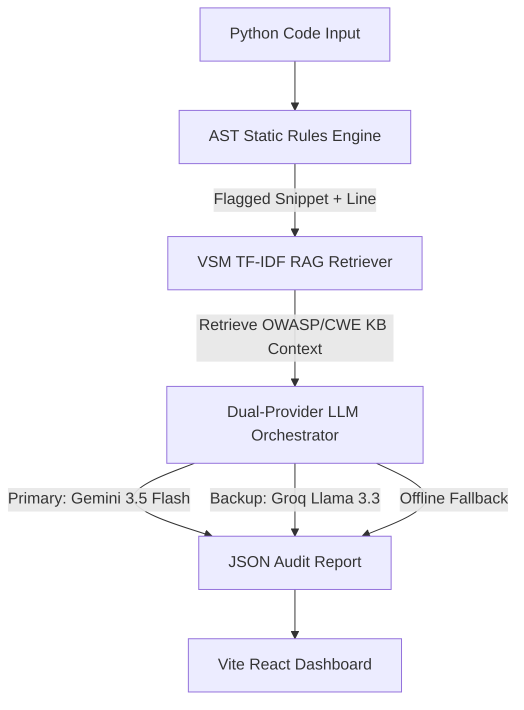

# 🛡️ SecureLens v1.0 — AI-Assisted Secure Code Auditor

SecureLens is a premium, developer-grade security auditing platform that scans Python source code for vulnerabilities using static analysis, retrieves context from a local security knowledge base, and uses Gemini 3.5 & Groq Llama 3.3 models to generate detailed risk reports, attack scenarios, and side-by-side secure code fixes.

---

## 🏗️ Architecture & Request Flow

SecureLens uses a multi-layered static analysis and RAG (Retrieval-Augmented Generation) pipeline:



1. **AST Analysis**: The Python source code is parsed into an Abstract Syntax Tree (AST) using 9 highly specific security rules (SQLi, Command Injection, Path Traversal, eval/exec, insecure pickle, hardcoded secrets, weak hashing, bare except blocks, and debug mode).
2. **VSM RAG Retrieval**: When a vulnerability is flagged, its AST context is sent to a custom TF-IDF Vector Space Model (VSM) retriever that queries our local OWASP/CWE knowledge base to find matching documentation.
3. **Dual-LLM Orchestration**: The combined code context and knowledge base documents are structured into a prompt and sent to the LLM client. It tries Google **Gemini 3.5 Flash** first, fails over to **Groq Llama 3.3** if Gemini fails or is rate-limited, and drops back to high-quality **Offline templates** if no internet or API keys are available.

---

## ⚡ Features & Capabilities

*   **Vulnerability Detection**:
    *   **SQL Injection (SQLi)**: Direct string concatenations inside SQL queries.
    *   **Command Injection (CmdI)**: Unsanitized inputs executed in system shells (`os.system`, `subprocess.call`).
    *   **Path Traversal**: Unchecked inputs passed to file system APIs.
    *   **Remote Code Execution (RCE)**: Dangerous use of `eval()` or `exec()`.
    *   **Insecure Deserialization**: Use of `pickle.loads` on untrusted input data.
    *   **Hardcoded Secrets**: AWS keys, JWT secrets, and tokens embedded in plain text.
    *   **Weak Hashing**: Insecure hashing algorithms like MD5 or SHA1.
    *   **Bare Excepts**: Catching all exceptions blindly (hides runtime errors).
    *   **Debug Mode**: Leaving `debug=True` active in web app production files.
*   **VS-Code Grade UI**: Monaco editor panel with demo templates, visual metrics cards, severity-grouped badges, and side-by-side comparative code diffs with copy-to-clipboard functionality.

---

## 🔌 API Documentation

### 1. POST `/api/scan`
Executes the security scan pipeline on the provided Python code string.

*   **Request Headers**: `Content-Type: application/json`
*   **Request Body**:
    ```json
    {
      "code": "import os\nos.system('ping ' + input_host)"
    }
    ```
*   **Response Body (200 OK)**:
    ```json
    {
      "findings": [
        {
          "type": "command_injection",
          "line": 2,
          "severity": "HIGH",
          "snippet": "os.system('ping ' + input_host)",
          "cwe_id": "CWE-78",
          "owasp_id": "A03:2021",
          "owasp_category": "Injection",
          "explanation": "Detailed explanation of why this command execution is dangerous...",
          "attack_scenario": "An attacker passes '; rm -rf /' to execute unauthorized shell commands.",
          "fix_snippet": "import subprocess\nsubprocess.run(['ping', '-c', '1', input_host])",
          "source_citation": "OWASP/CWE Local Reference"
        }
      ],
      "total": 1,
      "risk_score": "HIGH",
      "lines_scanned": 2
    }
    ```

### 2. GET `/api/health`
Returns the status of the scanner API.
*   **Response Body**:
    ```json
    {
      "status": "ok",
      "message": "Securelens service is running"
    }
    ```

---

## 🚀 Setup & Local Execution

### 1. Backend Setup
Configure your environment keys and start the FastAPI uvicorn server:

```bash
# Navigate to project root
cd SecureLens

# Install Python requirements
python3 -m pip install fastapi pydantic uvicorn python-dotenv --break-system-packages

# Add your API keys to the .env file in the root
# Open .env and add:
# GEMINI_API_KEY=your_key
# GROQ_API_KEY=your_key

# Start the server
python3 -m uvicorn backend.main:app --reload --port 8000
```
*Verify it is running by checking [http://localhost:8000/api/health](http://localhost:8000/api/health).*

### 2. Frontend Setup
Install packages and start the Vite development server:

```bash
# Install node packages
npm install

# Start Vite server
npm run dev
```
*Open the local address printed (usually [http://localhost:5173](http://localhost:5173)) in your browser.*

---

## 📦 Deployment & Tagging

*   **Frontend**: Set `VITE_API_URL` to point to your live backend endpoint and deploy on Vercel or Netlify.
*   **Backend**: Deploy the `backend/` folder on Railway, Render, or any VPS.
*   **Release Tag**: Tag this stable release as `v1.0.0` in Git:
    ```bash
    git tag -a v1.0.0 -m "Release SecureLens v1.0 - Stable Dual-LLM Auditing Dashboard"
    git push origin v1.0.0
    ```
