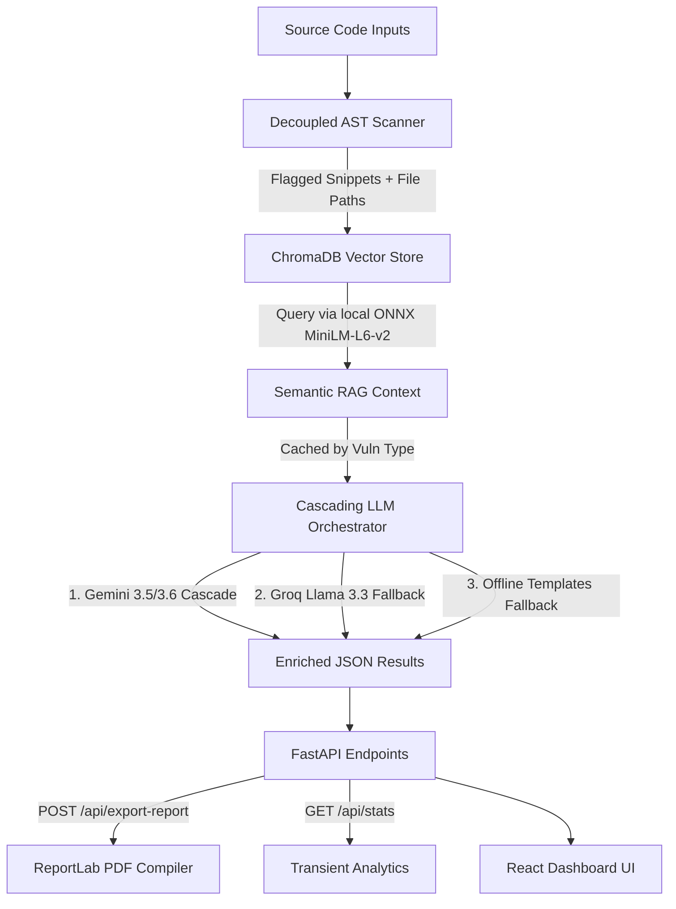

# 🛡️ SecureLens v2.0 — AI-Assisted Secure Code Auditor & RAG Security Platform

SecureLens is a premium, developer-grade security auditing platform that scans Python codebases for vulnerabilities using a modular AST static rules engine, retrieves semantic remediation guidance from a persistent local ChromaDB database using offline ONNX embeddings, and uses a cascading Gemini + Groq LLM pipeline to generate detailed risk reports and PDF deliverables.

---

## 🏗️ Architecture & Request Flow

SecureLens v2.0 implements a multi-layered static analysis and RAG (Retrieval-Augmented Generation) pipeline:



1. **AST Analysis**: The Python source code is parsed into an Abstract Syntax Tree (AST) using a decoupled registry pattern containing 13 security rules (SQLi, Command Injection, Path Traversal, eval/exec, insecure pickle, unsafe YAML, hardcoded secrets, weak hashing, pseudo-randomness, bare except blocks, assert misuse, socket binding interface configs, and Flask debug mode).
2. **Local ONNX Semantic RAG**: Flagged vulnerability types are embedded using a local **ONNX-based `all-MiniLM-L6-v2` sentence-transformer** model and matched against a persistent **ChromaDB** database of OWASP/CWE prevention guidelines using cosine similarity. If ChromaDB is offline, the retriever falls back to a lexical TF-IDF VSM engine.
3. **Optimized LLM Cascade**: Findings are batched and cached by vulnerability type. The pipeline queries the LLM cascade once per unique vulnerability type to generate the detailed explanation/remediation block. The cascade sequence runs sequentially: `GEMINI_MODEL` (e.g. `gemini-3.5-flash`) &rarr; `gemini-3.6-flash` &rarr; `gemini-3.5-flash-lite` &rarr; `gemini-2.0-flash` &rarr; Fallback to Groq (`llama-3.3-70b-versatile`).

---

## ⚡ Features & Capabilities

*   **13 Modular Security Detectors**: Built-in AST rules mapping to CWE and OWASP Top 10 vulnerabilities.
*   **Offline Vector Retrieval**: 100% free and offline semantic vector search using locally running ONNX models.
*   **Fail-Fast Latency Optimizations**: Connect timeouts capped at 5 seconds to skip overloaded LLM services instantly.
*   **ReportLab PDF Exporter**: In-memory PDF compiler creating beautifully designed corporate security reports containing metrics grids, vulnerability list tables, and side-by-side code diffs.
*   **Project-Level Scans**: Support for scanning multi-file directory structures in a single JSON payload.

---

## 🔌 API Documentation

### 1. POST `/api/scan`
Audits a single block of Python code.
*   **Request Body**:
    ```json
    {
      "code": "import os\nos.system('ping ' + host)"
    }
    ```

### 2. POST `/api/scan-project`
Audits multiple project files recursively.
*   **Request Body**:
    ```json
    {
      "project_name": "PortalApp",
      "files": [
        {
          "path": "app.py",
          "content": "import os\nos.system('ping ' + host)"
        },
        {
          "path": "utils.py",
          "content": "import hashlib\nh = hashlib.md5()"
        }
      ]
    }
    ```

### 3. POST `/api/export-report`
Compiles scan findings and returns a downloadable binary PDF report file.
*   **Response Header**: `Content-Type: application/pdf`

### 4. GET `/api/stats`
Returns aggregated historical scans run, average risk score, and finding counts by severity.

### 5. GET `/api/models`
Returns active Gemini cascade configurations and health statuses.

### 6. GET `/api/health`
Returns FastAPI health checks.

---

## 🚀 Setup & Local Execution

### 1. Backend Setup
1. Install Python requirements:
   ```bash
   pip3 install -r requirements.txt --break-system-packages
   ```
2. Build the local ChromaDB database (generates vector representations locally):
   ```bash
   python3 backend/rag/build_database.py
   ```
3. Add your API keys to the `.env` file in the root:
   ```env
   GEMINI_API_KEY=your_google_ai_studio_key
   GROQ_API_KEY=your_groq_api_key
   ```
4. Start the server:
   ```bash
   python3 -m uvicorn backend.main:app --reload --port 8000
   ```

### 2. Frontend Setup
```bash
npm install
npm run dev
```

---

## 📦 Deployment

*   **Frontend**: Set `VITE_API_URL` to point to your live backend endpoint and deploy on Vercel.
*   **Backend**: Deploy the `backend/` folder on Render or Railway. SecureLens automatically populates the vector store database in the cloud on first startup!
