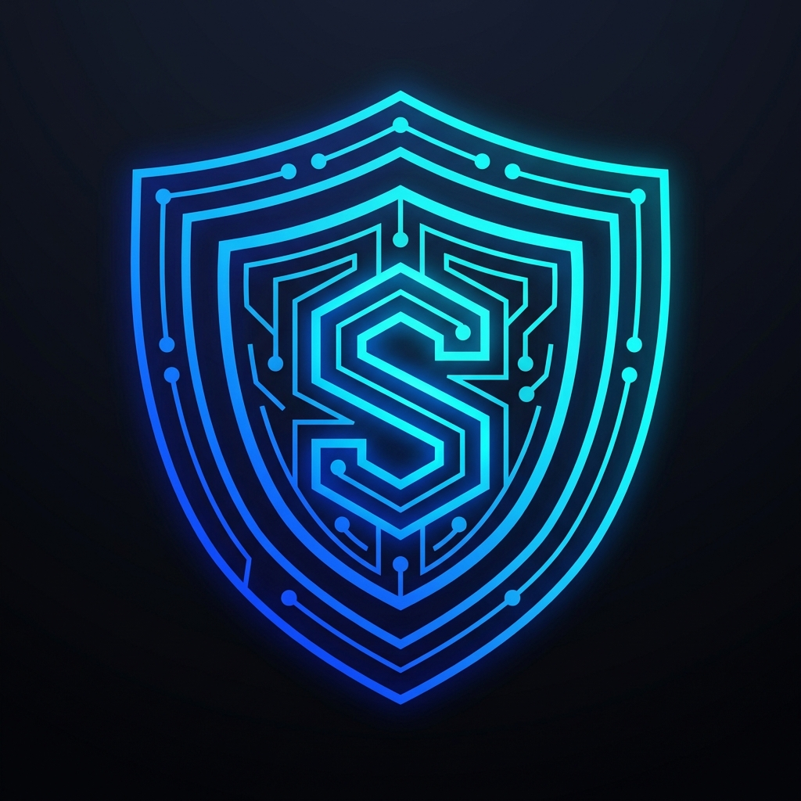
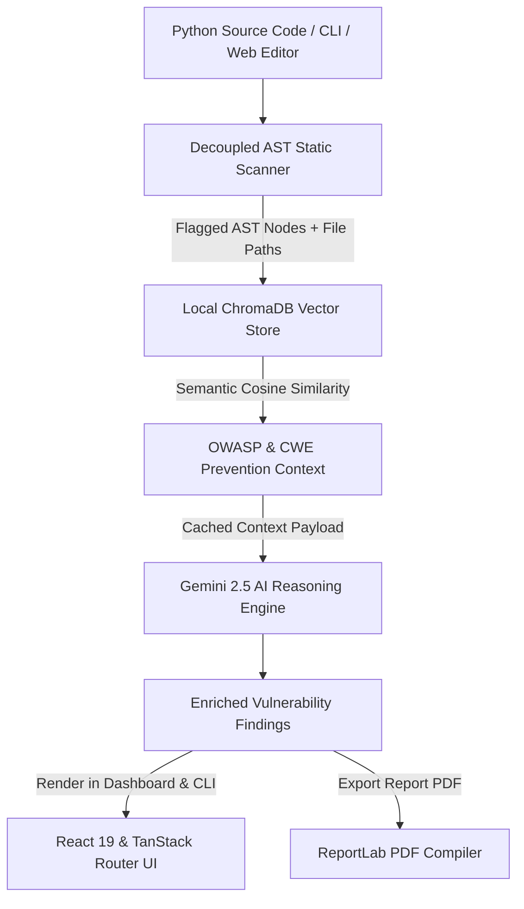

<p align="center">
  
</p>

<h1 align="center">🛡️ SecureLens — AI-Assisted Secure Code Auditor & RAG Platform</h1>

<p align="center">
  <b>Deterministic Python AST Static Analysis • Semantic Vector RAG Retrieval • Gemini 2.5 AI Reasoning • Official NPM CLI Package</b>
</p>

<p align="center">
  <a href="https://www.npmjs.com/package/securelens-ai"></a>
  <a href="https://github.com/Piy26ush/SecureLens/blob/main/LICENSE"></a>
  
  
</p>

---

## 🚀 Quick Start — Global NPM CLI Tool

You can run SecureLens instantly on any Python codebase in your terminal without installing software:

```bash
# 1. Fast AST Static Security Scan (< 100ms)
npx securelens-ai scan ./ --ast-only

# 2. Full AST + ChromaDB Vector RAG + Gemini AI Audit
npx securelens-ai audit ./ --rag

# 3. Export Executive Security PDF Report
npx securelens-ai export ./ --pdf
```

---

## 🏛️ Project Architecture & Design System

SecureLens features a **2-page high-converting SaaS product architecture** inspired by the Dala & Vercel design aesthetic:

1. 🏠 **Main Landing Page (`/`)**: Fast, high-converting home page with a 100% native HTML5 3D WebGL hero stage canvas, infinite tech stack marquee, 3 core security pillars, and animated rolling stat counters.
2. 🚀 **Interactive Capabilities Suite (`/features`)**: Dedicated interactive sandbox page housing the live Micro-Auditor code widget, 3D Vulnerability Class Radar Matrix (SQLi, Command Injection, Path Traversal, Deserialization), PDF Report Showcase, and macOS CLI Terminal.
3. 🖥️ **Auditor Workspace Dashboard (`/app`)**: Fixed viewport security auditor workspace featuring Monaco Code Editor, AST rule execution pipeline, risk score metrics, and side-by-side secure fix code diff comparisons.


```mermaid
graph TD
    A[Python Source Code / CLI / Web Editor] --> B[Decoupled AST Static Scanner]
    B -->|Flagged AST Nodes + File Paths| C[Local ChromaDB Vector Store]
    C -->|Semantic Cosine Similarity| D[OWASP & CWE Prevention Context]
    D -->|Cached Context Payload| E[Gemini 2.5 AI Reasoning Engine]
    E --> F[Enriched Vulnerability Findings]
    F -->|Render in Dashboard & CLI| G[React 19 & TanStack Router UI]
    F -->|Export Report PDF| H[ReportLab PDF Compiler]
```

---

## ⚡ Core Features & Capabilities

* **13 AST Security Rule Detectors**: Built-in deterministic static AST rules targeting SQL Injection (`CWE-89`), OS Command Injection (`CWE-78`), Path Traversal (`CWE-22`), Unsafe Deserialization (`CWE-502`), hardcoded secrets, weak hashing, and unsafe Flask/Django configurations.
* **Semantic Vector RAG Retrieval**: Queries a persistent local **ChromaDB** vector store using ONNX MiniLM embeddings for OWASP Top 10 and CWE guidelines.
* **Gemini 2.5 AI Fix Synthesis**: Generates grounded, hallucination-free secure code fixes and attack scenario explanations.
* **Executive Security PDF Exporter**: In-memory PDF compiler creating corporate security reports containing risk metrics, vulnerability list tables, and side-by-side code diffs.
* **GitHub Actions CI/CD Pipeline Automation**: Ready for integration into `.github/workflows/security.yml` to block vulnerable Pull Requests automatically.

---

## 📖 Detailed Documentation Index

All architecture, design, and CLI documentation is located in the [`docs/`](file:///Users/piyush/Desktop/SecureLens/docs) folder:

- 🎨 [`docs/FRONTEND_ARCHITECTURE_AND_ANIMATIONS.md`](file:///Users/piyush/Desktop/SecureLens/docs/FRONTEND_ARCHITECTURE_AND_ANIMATIONS.md) — Comprehensive guide on design system, 3D WebGL math, motion engineering, and TanStack Router 2-page architecture.
- 📦 [`docs/CLI_AND_NPM_PACKAGE_GUIDE.md`](file:///Users/piyush/Desktop/SecureLens/docs/CLI_AND_NPM_PACKAGE_GUIDE.md) — Step-by-step CLI usage, NPM registry deployment, subcommands, and CI/CD workflow setup.

---

## 🔌 API Reference

### 1. `POST /api/scan`
Audits a single block of Python code.

### 2. `POST /api/scan-project`
Audits multi-file project directories recursively.

### 3. `POST /api/export-report`
Compiles scan findings and returns a downloadable binary PDF report file.

### 4. `GET /api/stats`
Returns aggregated historical scan statistics and risk metrics.

---

## 💻 Local Development & Setup

### 1. Backend Setup (FastAPI & Python 3.12)
```bash
# 1. Install dependencies
pip3 install -r requirements.txt --break-system-packages

# 2. Populate ChromaDB Vector Database
python3 backend/rag/build_database.py

# 3. Add API Keys to .env
GEMINI_API_KEY=your_gemini_key

# 4. Start Server
python3 -m uvicorn backend.main:app --reload --port 8000
```

### 2. Frontend Setup (React 19 & TanStack Start)
```bash
npm install
npm run dev
```

---

## 📜 License
Distributed under the **MIT License**. See `LICENSE` for more information.
