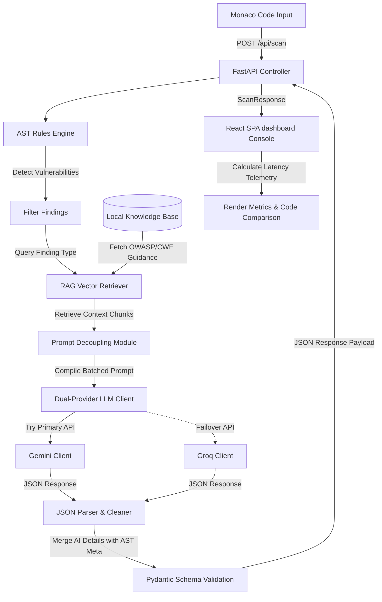

# SecureLens — System Architecture

This document maps the architectural flow of SecureLens, explaining how deterministic AST matching combines with semantic retrieval and LLM reasoning.

---

## 🗺 System Data Flow

---

## ⚙ Core Subsystems

### 1. The Controller & Validator (`main.py`)
*   Serves as the entry API server using **FastAPI**.
*   Validates all inputs and outputs using **Pydantic** validation models to maintain interface contract integrity.

### 2. Deterministic AST Scanner (`scanner/rules.py`)
*   Parses Python code into an Abstract Syntax Tree (AST) using Python's native `ast` module.
*   Traverses node representations to locate unsafe calls (e.g. `eval`, `exec`, string concatenations inside `sqlite3.connect` and `cursor.execute`, unvalidated `open()` variables).
*   Guarantees zero false positives for these deterministic structural rules.

### 3. RAG Retrieval Engine (`rag/retriever.py`)
*   Extracts guidance from a pre-ingested Markdown knowledge database.
*   Tokenizes documents and computes tf-idf vectors to find matching reference guidelines based on finding classifications.

### 4. High-Availability LLM Client (`scanner/pipeline.py`)
*   Builds structured prompts instructing the AI model to explain issues, write exploit scenarios, and output secure codes.
*   Maintains failover capabilities between Gemini and Groq Llama servers to prevent system outages.
*   Parses structural JSON outputs cleanly using regex markdown-stripping utilities.
